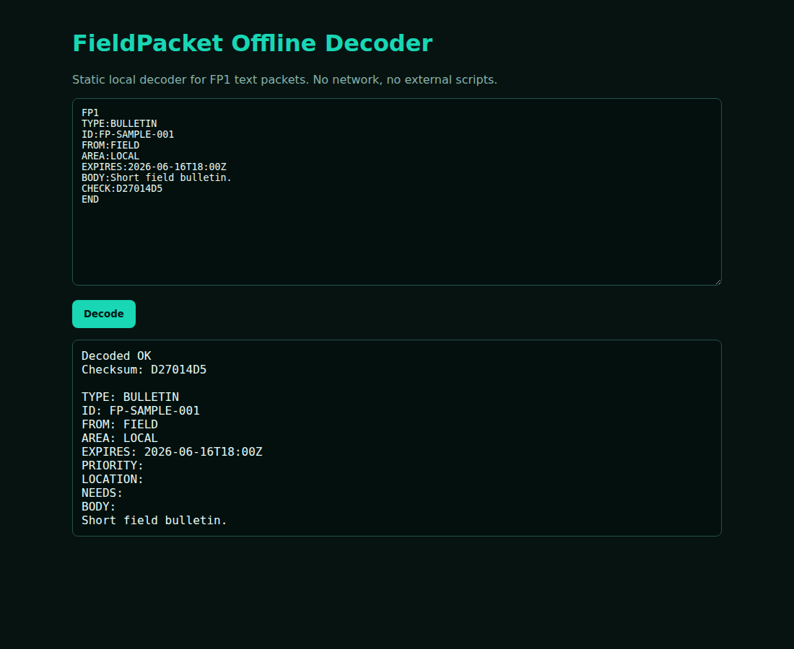

# FieldPacket

[](LICENSE)
[](https://github.com/custiecollector/Field-Packet/releases/latest)

FieldPacket is a standalone Android app for offline field-radio packet utilities. It composes, inspects, transmits, and decodes short plaintext FieldPacket/APRS/AX.25 workflows without accounts, servers, telemetry, or network access.

## Privacy and permissions

- Android application id: `org.fieldpacket.app`.
- No `INTERNET` permission.
- No cloud, accounts, telemetry, analytics, ads, contacts, SMS, phone, location, Bluetooth, USB, camera, advertising ID, or account permissions.
- `RECORD_AUDIO` is requested only when the user starts live microphone receive.
- Microphone hardware is optional for install compatibility; compose/decode/import tools can run without a microphone.
- No background listener or foreground microphone service.
- Generated tones, AFSK transmit buffers, live receive buffers, and PCM imports are processed in memory only.
- Saved message templates and operational presets are stored in app-private preferences.
- Android backup/device-transfer rules exclude app preferences, files, and databases.

See `PRIVACY.md` for details.

## Features

- FieldPacket FP1 bulletin and emergency message compose/decode.
- Offline pasted-packet decoder with CRC32 checksum validation.
- Static `web/fieldpacket-decoder.html` for browser-based offline decode.
- Known-good FP1 calibration packet generation.
- In-memory 1 kHz test tone generation.
- TX lead-in, tail, repeat, and level/gain controls.
- Hardware-neutral radio path presets for acoustic, cabled audio, KISS/TNC frame handling, and PCM import workflows.
- APRS/TNC2 compose panel with source callsign-SSID, destination, path, and information field.
- AX.25 UI frame generation with destination/source/digipeater fields, UI control byte, no-layer-3 PID, and AX.25 FCS.
- Bell 202 AFSK 1200 transmit audio generation using 1200 Hz mark, 2200 Hz space, NRZI, HDLC flags, and bit stuffing.
- User-started live microphone APRS/AFSK receive path with Bell 202 demodulation, AX.25 FCS validation, and APRS/TNC2/raw frame preview.
- RX diagnostics for peak/RMS, clipping, signal/sync state, FCS/checksum failure, and accepted packet state.
- KISS/TNC helpers for encoding the current AX.25 UI packet as a KISS data frame and decoding pasted KISS/TNC log hex in memory.
- User-selected WAV PCM or raw signed 16-bit little-endian PCM import for demodulated audio from external tools.
- Built-in reusable message templates plus one app-private custom template slot.
- One app-private operational preset for radio controls, transport profile, APRS addressing, and raw PCM sample rate.
- Dark compact Android UI with collapsed operator sections on launch.

## Boundaries

FieldPacket does not include:

- direct serial, USB, Bluetooth, or network device control
- Android SDR IQ demodulation or receiver tuning
- background listening
- persistent audio capture/storage

## FieldPacket text format

FieldPacket uses a line-oriented text envelope:

```text
FP1
TYPE:BULLETIN
ID:FP-20260616-0001
FROM:FIELD
AREA:LOCAL
EXPIRES:2026-06-16T18:00Z
BODY:Short bulletin text
CHECK:1234ABCD
END
```

Values are backslash-escaped (`\\`, `\n`, `\r`). `CHECK` is a CRC32 over the canonical packet lines before the checksum.

## APRS/AX.25 format

The APRS panels compose/decode TNC2-style APRS lines and AX.25 UI frames:

```text
NOCALL-7>APFP03,WIDE1-1:>FieldPacket BULLETIN FP-20260616-0001 from FIELD / LOCAL: Short bulletin text
```

The AX.25 frame is generated in memory only:

- Destination, source, and up to eight digipeater path address fields.
- Control byte `0x03` for UI frames.
- PID byte `0xF0` for no layer 3.
- ASCII APRS information field, clamped to 220 printable characters.
- AX.25 CRC-16/FCS appended little-endian before Bell 202 modulation.
- HDLC flags and bit stuffing applied before Bell 202 AFSK rendering.

## Downloads

Standalone Android APKs are published through GitHub Releases:

- [FieldPacket releases](https://github.com/custiecollector/Field-Packet/releases)
- Current APK: [`FieldPacket-0.1.13.apk`](https://github.com/custiecollector/Field-Packet/releases/download/v0.1.13/FieldPacket-0.1.13.apk)

A desktop FieldPacket tool suite is included in the DeadDrop Desktop Linux/Windows release for operators who want FP1 compose/decode, APRS/AX.25 preview, and KISS/TNC hex helpers on a desktop machine:

- [DeadDrop Desktop releases](https://github.com/custiecollector/dead-drop/releases)

The Android apps remain separate: FieldPacket is not merged into DeadDrop Android.

## Quick start

1. Download the current APK from [GitHub Releases](https://github.com/custiecollector/Field-Packet/releases/latest).
2. Install it on an Android device; no account, server, or network setup is required.
3. Open the compose/decode sections for FP1, APRS/AX.25, KISS/TNC hex, or PCM import workflows.
4. Use live microphone receive only when you explicitly start that mode.

## UI preview



## Build

Prerequisites:

- JDK 17 available through `JAVA_HOME` or `PATH`.
- Android SDK installed and `ANDROID_HOME` / `ANDROID_SDK_ROOT` set.
- Android build-tools with `aapt` and `apksigner` available under `$ANDROID_HOME/build-tools/`.
- Gradle 8.10.x available as `gradle`.

Build:

```bash
gradle --no-daemon clean assembleRelease
```

Inspect an APK before sharing it:

```bash
APK=app/build/outputs/apk/release/app-release.apk
BUILD_TOOLS="${ANDROID_HOME}/build-tools/35.0.0"
"${BUILD_TOOLS}/aapt" dump permissions "$APK"
"${BUILD_TOOLS}/apksigner" verify --verbose --print-certs "$APK"
```

Expected permission posture: `android.permission.RECORD_AUDIO` may appear; `android.permission.INTERNET` must not appear.

## License

FieldPacket is licensed under the Apache License, Version 2.0. See `LICENSE`.
